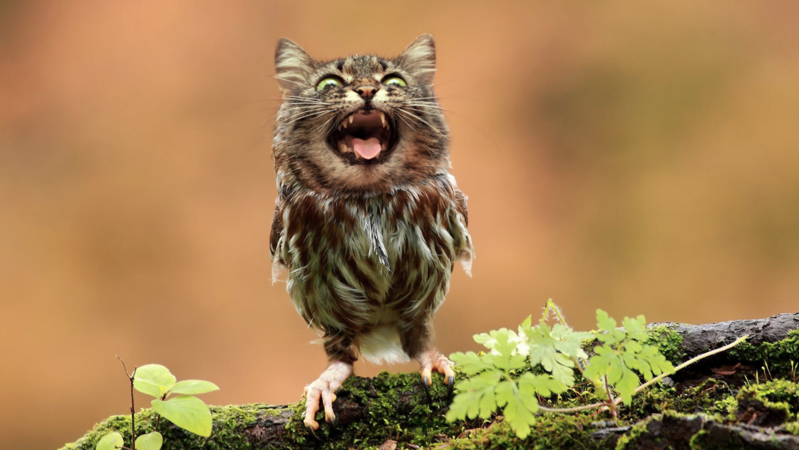

# Catowls

## What are catowls?

Catowls are the ***cutest*** *hybrid*[^1] between a **cat** and an **owl**.


Meow!

[^1]: They have the body of ~~a bird~~ an owl and the face of a cat.

## Why should i care

You should care because:
1. Catowls are cute
2. Catowl
3. Catowl ok

### What some guy said:

> This is not a catowl
>
> This is a meowl
Ok what a dumdum name...

### Naming

The name of these creatures is:
- [x] catowl
- [ ] meowl

## Appreciation

You can find fellow catowl enthusiasts at [Catowls](https://old.reddit.com/r/OwlsWithCatHeads/)

## How to know if catowls are cute

Here's the truthtable to help you out:
Table:
| p | q | p AND q |
| --- | --- |
| 1 | 1 | 1 |
| 1 | 0 | 0 |
| 0 | 1 | 0 |
| 0 | 0 | 0 |

Where *p* is if it has a cat face and *q* is if it has an owl body.

---

# Heading1

## Heading2

### Heading3

#### H4

##### H5

###### H6

normal text
**bold text**
*italics text*
~~strikethrough~~
`monospace line`
```
monospaced
block
```
==highlight==
text~subscript
text^superscript

:emogi:

Horizontal rule:
---

Text [^1]

> blockquote
>
> blockquote

Ordered List
1. First element
2. Second element
3. Third element

Unordered List
* Element
* Element
* Element

Checklist
- [x] checked item
- [ ] unchecked item

Link: [title](https://www.example.com)
Image: 

Table:
| Cell | Next Cell |
| -------- | --------- |
| Cell | Another cell |

text
: definition

[^1]: footnote